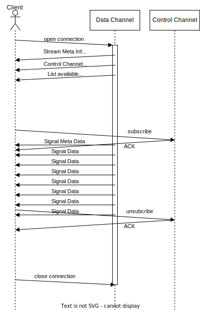

# Stream Protocol Introduction

## About this document
This document is intended as a starting point when trying to understand or implement the openDAQ Stream protocol. It is by no means a replacement for the full specification found in the [openDAQ documentation](https://docs.opendaq.com/). It rather serves to give an overview over the protocol and how it can be applied to the most common use cases of data acquisition devices. For this purpose it simplifies aspects of the specification while omitting others. This imposes the challenge to balance intelligibility against completness. The document aims to find a middle ground while not being blatantly incorrect.

## Intruduction
The openDAQ Stream Protocol is a powerfull tool for data exchange. Its purpose is to provide a consistent, gap-less and interpretable data stream between two endpoints. The use cases and applications of the protocol are diverse and complex. Synchronization, timestamping, ..., are all aspects of the protocol that go beyond the intuitivly "simple" scope of transmitting measurement values. 

## Basics
The openDAQ stream protocol specifies the communication between two endpoints, which are called the 'client' and the 'server'. In this context, the server acts as the provider of stream data e.g. a data acquisition device. The client on the other hand is the consumer of the data. A straightforward example of a client can be a data processing software running on a computer. A generic client implementation should aim to implement all aspects of the protocol, to provide compatibitily with the maximum number of devices. A server on the other hand can have a restricted feature set which is defined by the requirements of its application.

## Transport Layer
Two distinct commuincation channels are specified in the openDAQ Stream protocol. The first is called the 'Data Channel'. It is a unidirectional channel between the server and client. The direction of the data flow is from the server to the client. The second channel is the optional 'Control Channel'. It allows bidirectional communication asynchronous to the Data Channel in order to exchange control messages. More information on the Control Channel can be found in the chapter of the same name further below.

The protocol specification itself does not concern itself with the nature of the transport layer. It is agnostic towards the implementation. The requirements towards the transport layer are that it must allow binary communication at a viable data rate. The most common implementations for networking are based on TCP/IP or Websockets. Implementations for inter-process communcation are based on named or unnamed pipes.

Communication is initially started by the client on the Data Channel. Therefore the paramters of the Data Channel required to initiate the communication have to be known a priori by the client. How this information is made available at the client is outside the scope of the protocol specification. openDAQ solves this by announcing the parameters through Multicast DNS.

## Signal Concept
The data representation of openDAQ Stream is based on the concept of signals. A signal is compromised of two aspects: a signal definition and the signal data. The signal definition is described in the protocol specification. It contains properties of the signal which specify the interpretation and presentation of the signal data. It is the responsibility of the server (and by extension the programmer) to define which signals the server provides and to define their properties.

### Example
The following picture gives an example as it is found in many data acquisition system. 

Digitized samples of a time-discrete signal: On the x-axis we have the time, moving linearly from left to right. On the y-axis we find the digital representation of some physical quantity (e.g. Newton, Volt, etc). The underlying physical signal is sampled (and digitized) at equidistant points in time marked on the x-axis (t0, t1 and so forth). The measured values are named accordingly v0, v1 and so on. In more advanced system, the measured values can be further extended with a measurement status. In the simplest case, the status only states if the value is valid or not. In the example, this information is color coded in the chart by red or green dots. In a more complex system, the measurement status can contain additional information, such as precision information or diagnostic data (e.g. report overload of sensor or amplifier).

> NOTE: A unified specification of measurement state is currently under developement in openDAQ.

In the context of openDAQ Streaming, a setup as seen in the example is modelled with three signals.
| index |signalv|signalt|signals|
|:-----:|:----------------:|:----------------:|:----------------:|
| 0 | v0 | t0 | 1 |
| 1 | v1 | t1 | 1 |
| 2 | v2 | t2 | 1 |
| 3 | v3 | t3 | 1 |
| 4 | v4 | t4 | 1 |
| 5 | v5 | t5 | 0 |
| 6 | v6 | t6 | 1 |
| 7 | v7 | t7 | 1 |
| 8 | v8 | t8 | 1 |

The first signal is the value signal. It contains the digitized result of the data sampling. The second signal is the time signal. A special relationship between these two signals exists. The latter one is named the domain signal of the former as here we see values plotted over time. We can imagine other domain signals, e.g. where values are plotted over frequencies (in Fourier space). 

We further encode the measurement status as a simple numeric value. This would be the third signal of our consideration. The three signals are linked through the concept of a table. A table groups signals that semantically belong together. Each table contains a set of signals, and each signal belongs to one table (one-to-many relation).

## Signal Rules
Each openDAQ signal definition contains the property "rule". It defines how signal data is serialized and transmitted on the Data Channel.

### Explicit Signal
Explicit signals are signals where each sample is transmitted, usually en-block to conserve bandwidth. Up to version 1.0.0 of the protocol the index of a sample was never transmitted explicitly, it was inferred on the client side from the number of samples received. Starting with version 1.0.1 of the protocol the starting index of a value signal can (optionally) be transmitted with the signal meta information in the field "valueIndex" upon the subscribe. This enables sharing a time (and status) signal between several value signals while still allowing to subscribe/unsubscribe from every value signal individually. If the "valueIndex" is omitted, it is assumed to be 0.

In the table below we can see an extension of the example above. A second value signal signaly is introduced, which shares a time and status signal with signalv. When signaly is subscribed, 5 values have already been transmitted on signalv. To make the correct sample time of y5 and all subsequent samples known to the client the server has to trasmit the value of 5 in the "valueIndex" field of signaly's meta information.

| index |signaly|signalv|signalt|signals|
|:-----:|:----------------:|:----------------:|:----------------:|:----------------:|
| 0 |               | v0 | t0 | 1 |
| 1 |               | v1 | t1 | 1 |
| 2 |               | v2 | t2 | 1 |
| 3 |               | v3 | t3 | 1 |
| 4 |               | v4 | t4 | 1 |
| 5 | y5 | v5 | t5 | 0 |
| 6 | y6 | v6 | t6 | 1 |
| 7 | y7 | v7 | t7 | 1 |
| 8 | y8 | v8 | t8 | 1 |

### Constant Signal
Constant signals are signals where only changes of its value are transmitted, not every sample explicitly. The status signal in the example above is a good candidate for such a modelling. The measurement status usually does not update with every sample, so to conserve bandwidth it can be beneficial to model it as a constant signal. In this case, the new value is transmitted together with the index of the new value.

### Linear Signal
Linear signals are similar to constant signals, as not every sample is transmitted. Signal Definitions of Linear signals contain the additional property "delta". It defines the numeric value which is recursivly added for each sample on the client side. The client therefore only needs to know the initial value of the signal and can calculate subsequent values indefinitly. When a new value is transmitted to the client, the accumulator is reset to this value (at a specified index). The time signal in the example above is a good candidate for such a signal.

## Data Types
Each signal has the property "dataType". It can be one of the following Base Data Types or a Composite Type.
Base Data Types:
- int8
- uint8
- int16
- uint16
- int32
- uint32
- int64
- uint64
- int128
- uint128
- real32
- real64
- complex32: Contains two elements ("real" and "imag") of real32 
- complex64: Contains two elements ("real" and "imag") of real64 
- bitField

Composite Types:
- Structure: A combination of named members which may be of different types.

## Control Channel
The optional Control Channel allows the client to subscribe (and unsubscribe) the reception of signals. On servers which implement the Control Channel no signal data is transmitted by default after the connection on the Data Channel has been established. Only after the a subscription was executed (which can be at any arbitrary point in time) is data transmitted. The client can choose at any point to again unsubscribe from a signal while keeping the Data Channel connection open.

Servers that do not implement the Control Channel automatically start sending their signal data after the connection on the Data Channel has been established. Transmition only stops when the connection is closed.

The Control Channel is mostly implemented as JSON RPC over HTTP. All signals are identified for this purpose by a unique (for this server) name in ASCII format. The name might also be used in a GUI as a label for the signal.

## Sequence diagram

The sequence diagram shows a simplified sequence of the openDAQ Stream Protocol where a Control Channel is present. The client opens the connection to the server. The server accepts the connection and replies with three messages:
1. A message containing basic stream meta information
2. A message specifiying the parameters of the Control Channel. In case of JSON RPC over HTTP, it contains the port of the webserver, as well as the HTTP method and path for the request.
3. A message listing all available signals in the server.

At some point the client decides (possibly upon user request) to send a subscribe request to the server. If this is successfull, the server responds on the Data Channel with the requested signals meta information. The signal definition is contained within this block. Starting from this point in time signal data is continously transmitted, until an unsubscribe request is received. Afterwards the Data Channel is held open indefinitely and only closed upon request of the client.

## Stream ID
The stream ID is a secret shared between the client and the server. It is generated in the server upon the connection request of the client and transmitted to the client in the stream meta information. It is implemented as a string and should be unique for each Data Channel connection (!). The client incorporates the Stream ID into the Subscribe/Unsubscribe requests on the Control Channel to allow the server to find the matching Data Channel for each request. This is relevant for servers which allow multiple Data Channels to be opened at the same time (from multiple clients). The Stream ID is irrelevant if no Control Channel is present in the server.